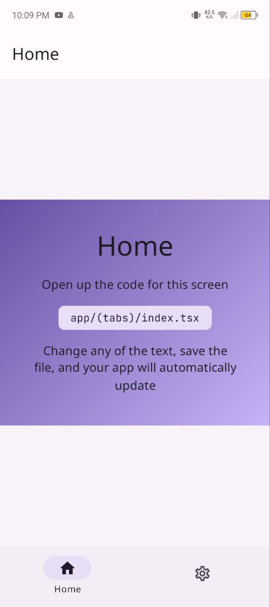
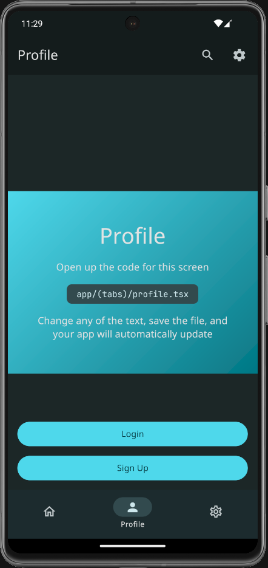
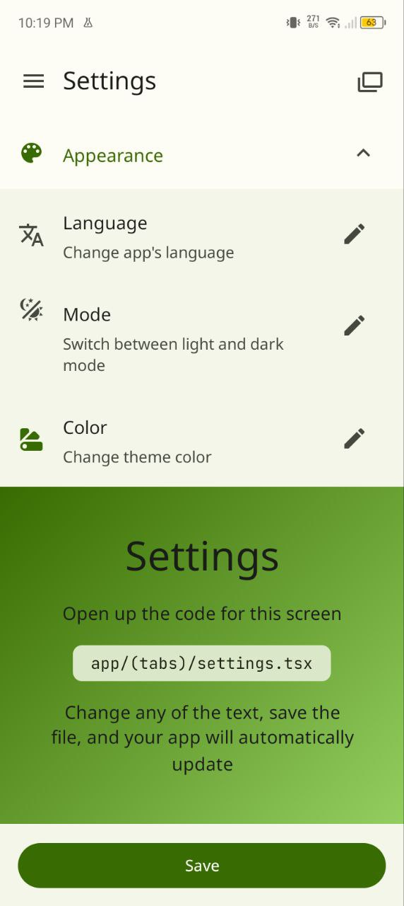
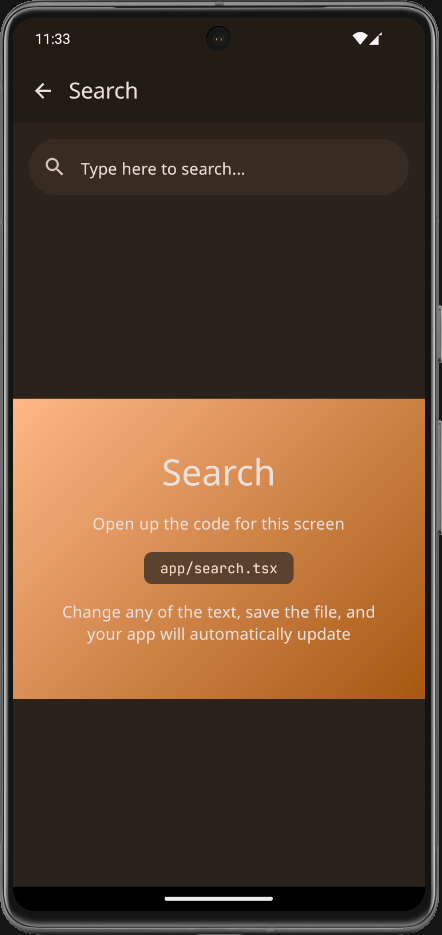
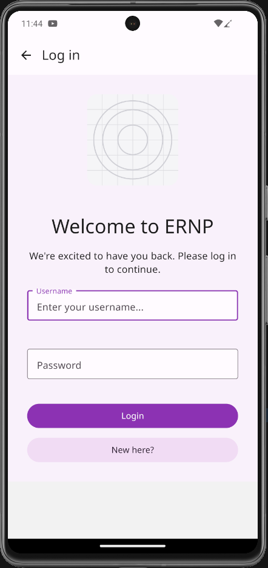
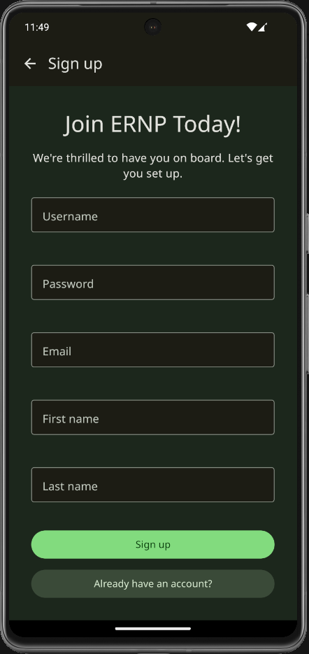

# expo-react-native-paper

[](https://github.com/youzarsiph/expo-react-native-paper/actions/workflows/codeql.yml)
[](https://github.com/youzarsiph/expo-react-native-paper/actions/workflows/eslint.yml)
[](https://github.com/youzarsiph/expo-react-native-paper/actions/workflows/prettier.yml)

This repository is a template for React Native Expo applications. It integrates Expo Router and React Native Paper. It also demonstrates how to use Github Actions for linting and formatting.

## Features

- Expo
- Expo Router
- Material Design V3
- Light & Dark modes with custom themes
- Cross Platform
- LTR and RTL support
- Multi lingual (`ar`, `en` and `tr`)
- CI/CD

## Platforms

- Web
- IOS
- Android

## Screenshots










## Getting Started

These instructions will get you a copy of the project up and running on your local machine for development and testing purposes.

### Prerequisites

- Node.js
- npm

### Installation

Clone the repo:

```bash
git clone https://github.com/youzarsiph/expo-react-native-paper.git
```

Open `package.json` and update the `name` field to match your app's name:

```jsonc
{
  // Change the following line
  "name": "expo-react-native-paper",
  "main": "expo-router/entry",
  "version": "1.0.0",
  ...
}

```

Install dependencies:

```bash
npm install
```

Run the app:

```bash
npm start
```

## Built With

- TypeScript
- React
- React Native
- Expo
- Expo Router
- React Native Paper

## Contributing

Contributions are what make the open-source community such an amazing place to learn, inspire, and create. Any contributions you make are greatly appreciated.

1. Fork the Project
2. Create your Feature Branch (git checkout -b feature/AmazingFeature)
3. Commit your Changes (git commit -m 'Add some AmazingFeature')
4. Push to the Branch (git push origin feature/AmazingFeature)
5. Open a Pull Request

## License

Distributed under the MIT License. See LICENSE for more information.
