# expo-react-native-paper

[](https://github.com/youzarsiph/expo-react-native-paper/actions/workflows/codeql.yml)
[](https://github.com/youzarsiph/expo-react-native-paper/actions/workflows/eslint.yml)
[](https://github.com/youzarsiph/expo-react-native-paper/actions/workflows/prettier.yml)

This repository is a template for React Native Expo applications. It integrates Expo Router and React Native Paper with bottom navigation.

## Platforms

- Web
- IOS
- Android

## Screenshots

### Light Theme

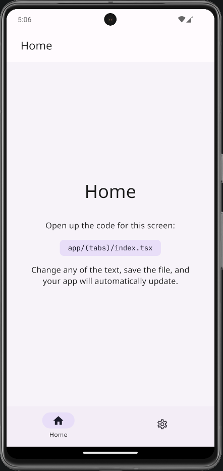

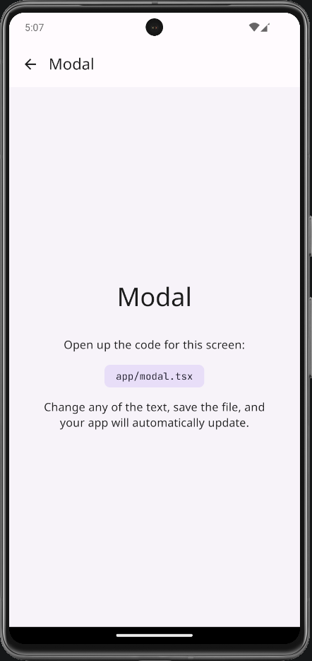

### Dark Theme

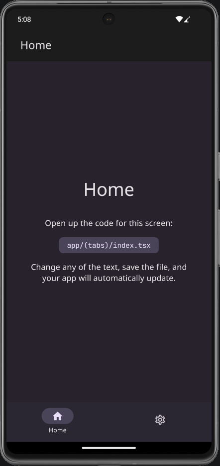
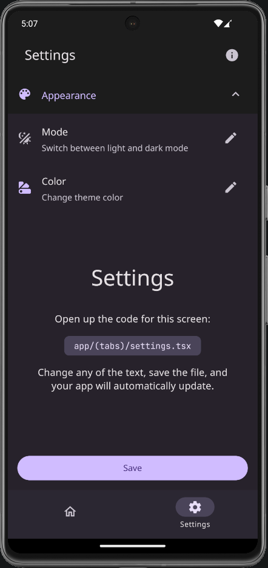
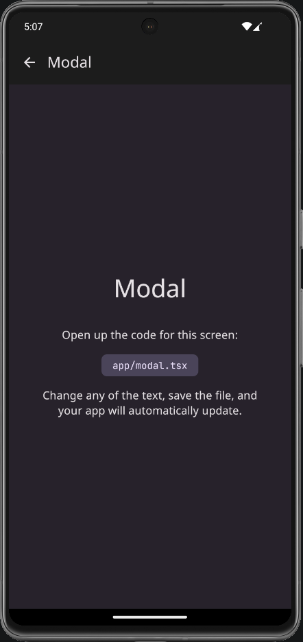

### Custom Themes

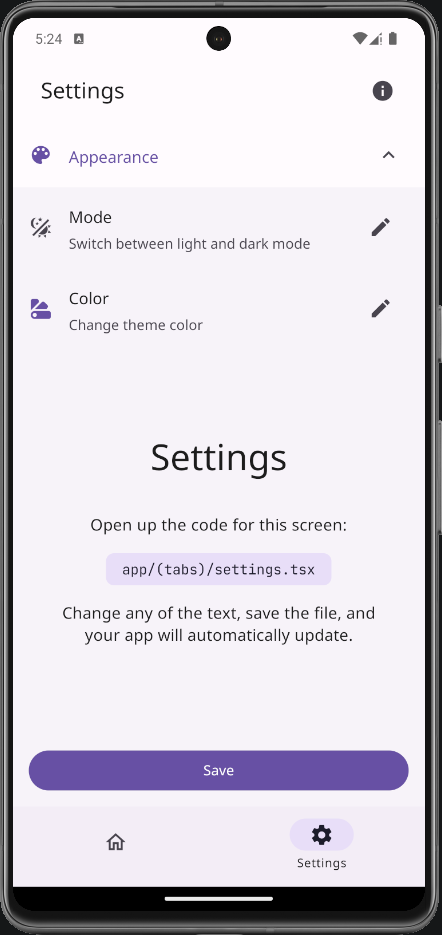
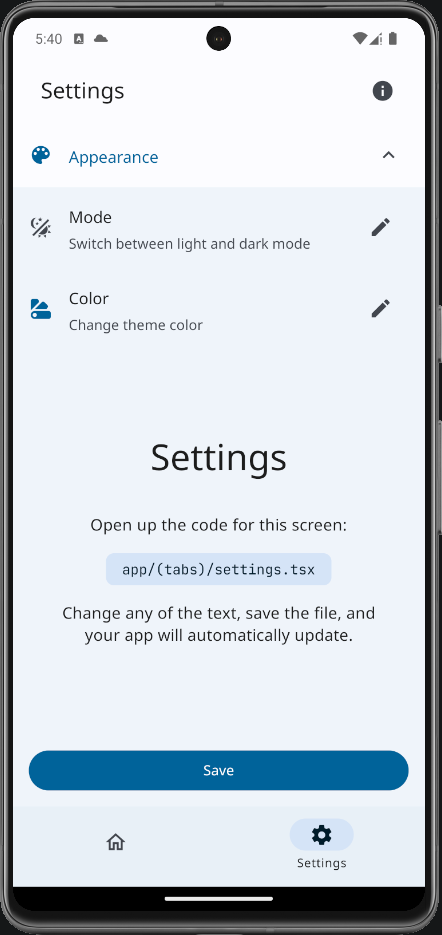
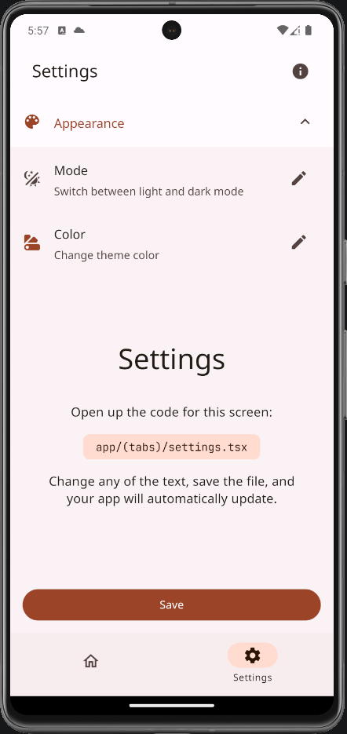
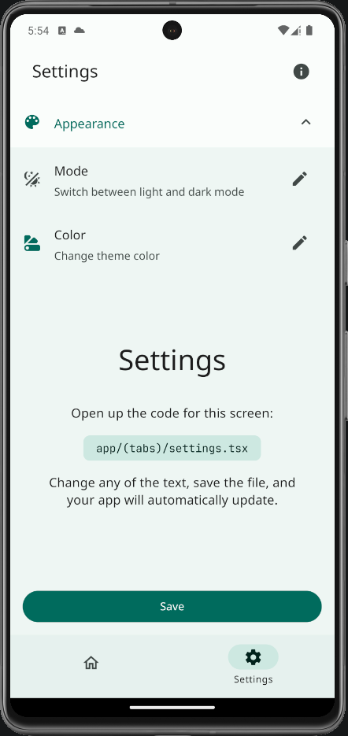
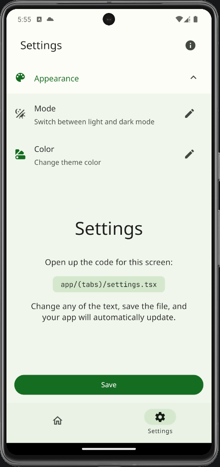
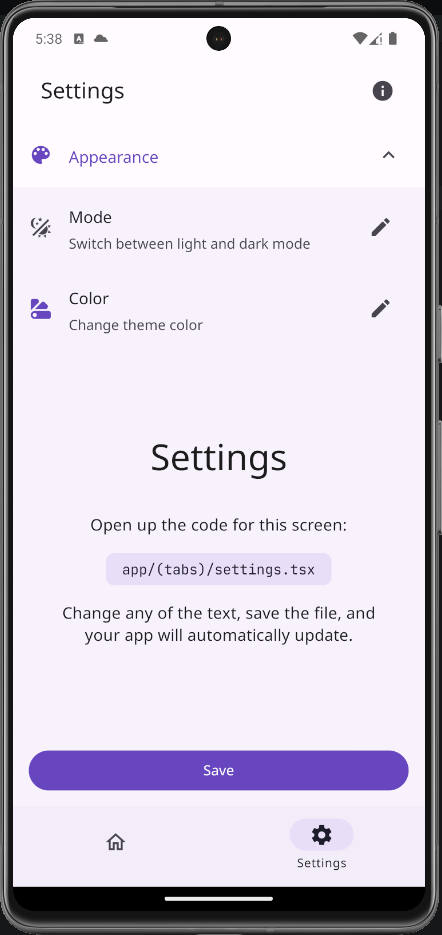
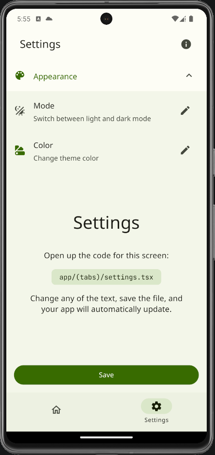
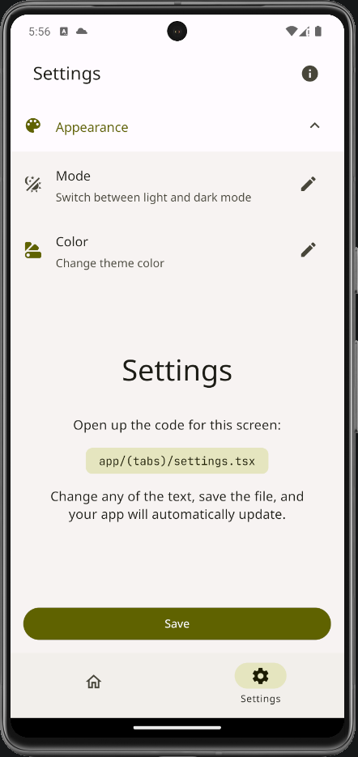
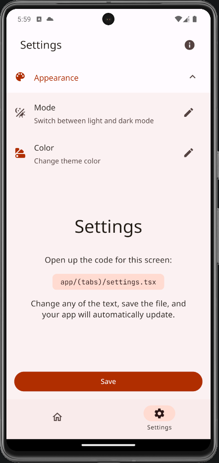

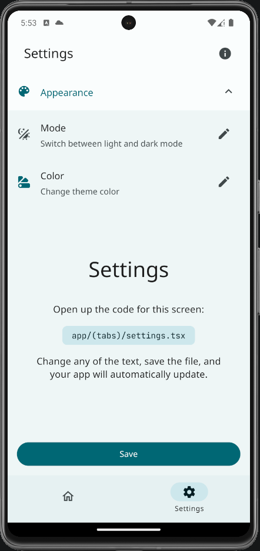
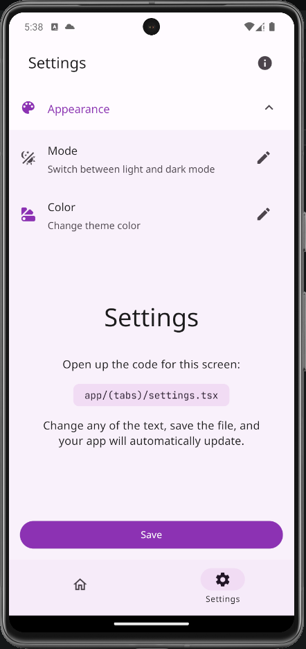

## Getting Started

These instructions will get you a copy of the project up and running on your local machine for development and testing purposes.

### Prerequisites

- Node.js
- npm

### Installation

1. Clone the repo
   ```sh
   git clone https://github.com/youzarsiph/expo-react-native-paper.git
   ```
2. Open `package.json` and update the `name` field to match your app's name
3. Install NPM packages
   ```sh
   npm install
   ```

## Built With

- React Native
- Expo
- Expo Router
- React Native Paper

## Contributing

Contributions are what make the open-source community such an amazing place to learn, inspire, and create. Any contributions you make are greatly appreciated.

1. Fork the Project
2. Create your Feature Branch (git checkout -b feature/AmazingFeature)
3. Commit your Changes (git commit -m 'Add some AmazingFeature')
4. Push to the Branch (git push origin feature/AmazingFeature)
5. Open a Pull Request

## License

Distributed under the MIT License. See LICENSE for more information.
